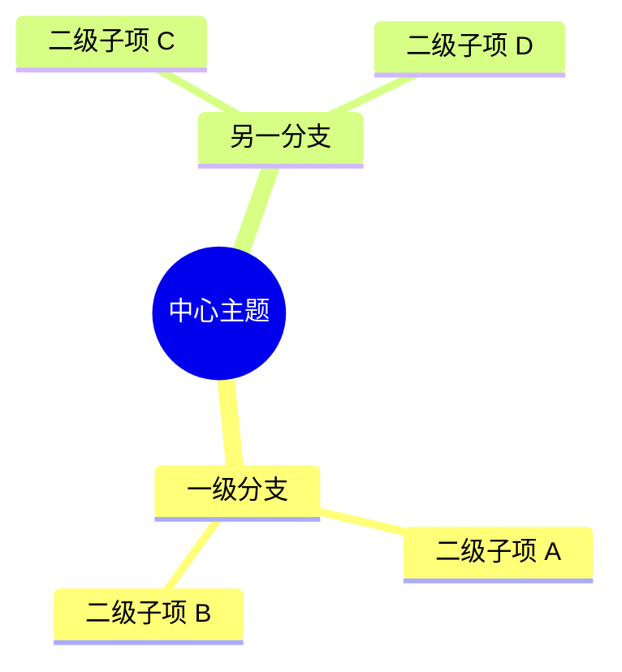

# Kroki: Diagram-as-Code 替代方案评估

## 概述

Kroki (https://kroki.io/) 是一个统一 API 服务，将文本格式的图表描述（PlantUML、Mermaid、GraphViz、D2、Excalidraw、BlockDiag 等 20+ 种）转换为 PNG/SVG/PDF 图片。Java 后端（Vert.x 框架），由 yuzutech 维护。

## 结论：不推荐使用

在多个项目中实测发现 Kroki 不适合作为生产环境的图表渲染方案。

## 关键问题

### 1. 公共实例不可用
- `https://kroki.io/` 返回 **404**
- 无法直接通过公共 API 生成图表
- 原因可能是服务关闭、迁移或 DNS 问题，均无法从外部恢复

### 2. 没有官方 CLI 工具
- 官方文档导航栏有「Kroki CLI」页面链接（Usage > Kroki CLI），但实际页面返回 **404**
- GitHub Releases 只有 `.jar` 文件，无独立二进制 CLI
- 不存在于以下包管理器：
  - npm: `kroki` / `kroki-cli` ❌
  - PyPI: `kroki` / `kroki-cli` ❌
  - Homebrew: ❌

### 3. 本地部署门槛高
- 唯一官方推荐方式：**Docker** (`docker run -p 8000:8000 yuzutech/kroki`)
- 手动部署需要 Java 11+ 和 Maven 构建
- 每个图表库（Mermaid、BPMN、Excalidraw 等）需额外运行独立微服务容器

### 4. 使用方式局限
所谓「CLI 用法」实际上只是 curl 调用 HTTP API：

```bash
# JSON POST
curl -X POST https://kroki.io/ \
  -H "Content-Type: application/json" \
  -d '{"diagram_source":"...","diagram_type":"plantuml","output_format":"svg"}'

# Plain text POST
curl -X POST https://kroki.io/plantuml/svg \
  -H "Content-Type: text/plain" \
  -d "Bob -> Alice : hello"

# GET 方式（deflate+base64 编码 URL）
curl https://kroki.io/plantuml/svg/<encoded> > out.svg
```

因公共实例已挂，以上方式均不可用。

## 推荐替代方案

| 需求 | 推荐方案 |
|------|---------|
| Mermaid 渲染（MMD→图片） | `mmdc -i input.mmd -o output.png`（已全局预装） |
| PlantUML 渲染 | PlantUML 官方 jar + GraphViz 本地安装 |
| 内嵌 Markdown | Hermes `markdown-viewer` skill（PlantUML/Mermaid/Vega 代码块） |
| Markdown 预览 | VS Code 安装 Mermaid / PlantUML 插件 |

## Mermaid CLI（mmdc）— 预装且可用

### 位置与版本

- 路径：`C:\Users\Admin\AppData\Roaming\npm\mmdc.cmd`
- 版本：11.16.0（全局安装 `@mermaid-js/mermaid-cli`）
- 可直接通过 `mmdc` 命令调用（在 Shell 中）

### 基本用法

```bash
# PNG 输出（支持透明背景）
mmdc -i diagram.mmd -o output.png -w 1200 -H 900 -b transparent

# SVG 输出
mmdc -i diagram.mmd -o output.svg -w 1200 -H 900

# PDF 输出
mmdc -i diagram.mmd -o output.pdf -w 1200 -H 900
```

### 思维导图（Mindmap）渲染 — 实测通过

Mermaid mindmap 语法在 mmdc 中正确渲染，树状结构完整、连线清晰、颜色编码准确。示例 `.mmd` 文件格式：



> **实测结果**：PNG 输出（1200×900，透明背景）44KB，树状结构、颜色编码、文字排版均正确。

### mmdc 与 Kroki 对比

| 维度 | Kroki | mmdc (Mermaid CLI) |
|------|-------|--------------------|
| 部署方式 | Docker 容器或 Java JAR | 仅需 npm 全局安装 |
| CLI 存在性 | ❌ 无（仅有 HTTP API） | ✅ 一行命令出图 |
| 预装状态 | ❌ 需自行部署 | ✅ 已全局预装 |
| 私网/离线 | ❌ 公共实例 404 | ✅ 本地离线可用 |
| 输出格式 | PNG/SVG/PDF/Base64/TXT | PNG/SVG/PDF |
| 图表类型 | 20+ 种（PlantUML/Mermaid/GraphViz…） | Mermaid 生态（流程图/时序图/思维导图/Gantt/甘特图…） |
| 学习成本 | 需理解 deflate+base64 编码或 JSON POST | 零学习，直接写 `.mmd` 文件 |

### 注意

- mmdc 依赖 Puppeteer/Chromium —— 首次使用会自动下载 Chromium（约 150MB）
- 如果 mmdc 报 `browser not found` 错误，运行 `npx puppeteer browsers install chrome` 手动安装

## 相关链接

- GitHub: https://github.com/yuzutech/kroki
- 官方文档: https://docs.kroki.io/
- Mermaid CLI: `npx @mermaid-js/mermaid-cli`
- Hermes mmdc 路径: `C:\Users\Admin\AppData\Roaming\npm\mmdc.cmd`
