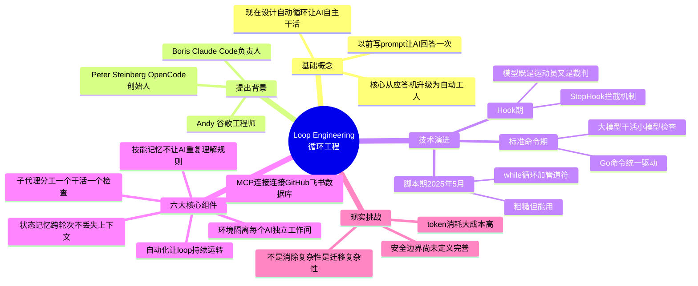

# Loop Engineering 思维导图 Mermaid 代码

## 推荐样式（带颜色分组）



## 渲染方式

### 在线渲染（mermaid.ink）
```python
import base64, requests

mermaid_code = '...'  # 上面完整代码
encoded = base64.urlsafe_b64encode(mermaid_code.encode()).decode()
url = f"https://mermaid.ink/img/{encoded}"

resp = requests.get(url, timeout=30)
with open("output.png", "wb") as f:
    f.write(resp.content)
```

### 本地渲染（mmdc）
```bash
"C:\Users\Admin\AppData\Roaming\npm\mmdc.cmd" -i loop.mmd -o loop.png -b white -w 1920 -H 1080
```

## 注意事项
- `mermaid.ink` 可用，`kroki.io` 全部 404
- 图片插入飞书文档需用 user token 或让用户手动复制粘贴